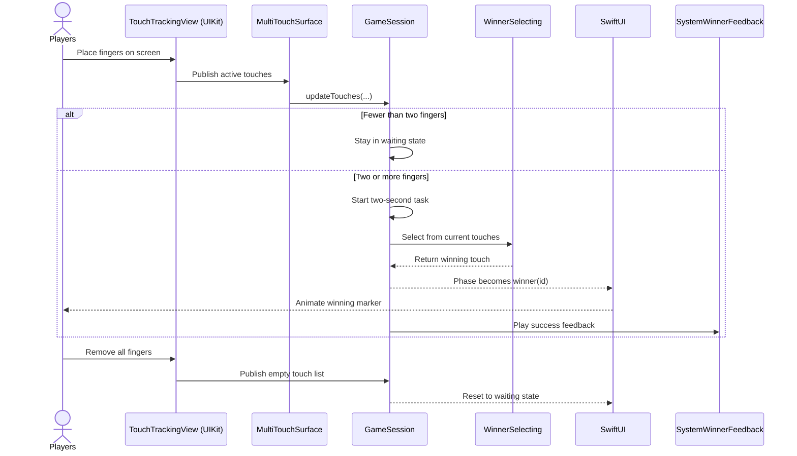
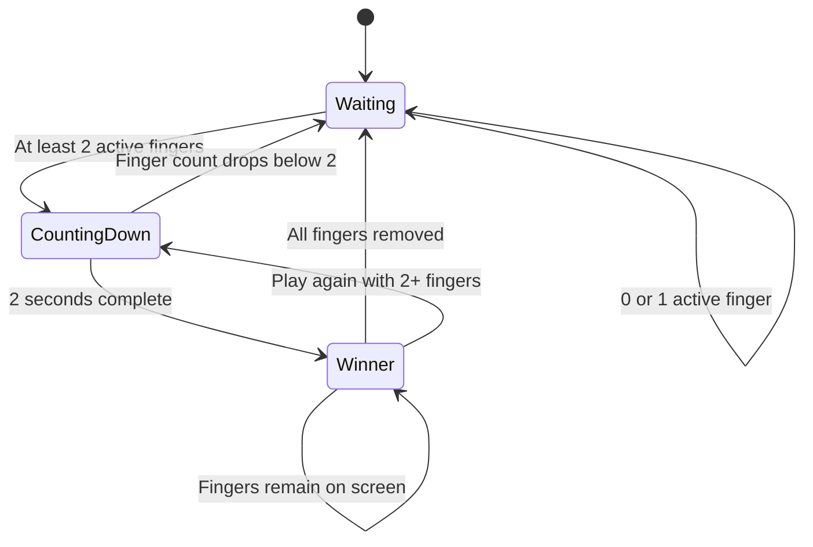
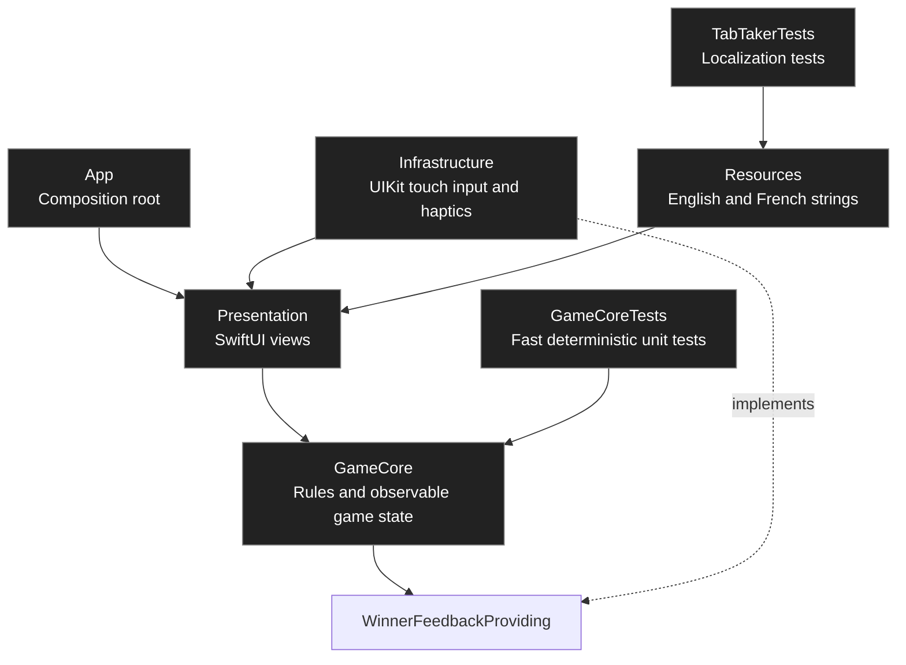

# TabTaker

TabTaker is a small iOS party game. Two or more people place a finger on the screen, keep their fingers down for two seconds, and the app randomly chooses who pays.

The user-facing name, Xcode project, scheme, source target, and bundle identifier are consistently named `TabTaker`.

The project is intentionally small, but structured as a production-quality Swift application. It uses SwiftUI for the interface, a minimal UIKit bridge for true multi-touch input, dependency injection for testability, and Google's Mobile Ads and User Messaging Platform SDKs for consent-aware advertising.

## Features

- Simultaneous multi-touch tracking
- A distinct color and number for every finger
- Two-second countdown that is cancelled when fewer than two fingers remain
- Random winner selection
- Winner animation and haptic feedback
- Automatic reset after all fingers are removed
- English and French localization
- No backend, account, application analytics, or authentication
- Optional consent-aware interstitial ads, shown at most once every four completed rounds

## Requirements

- Xcode 16 or later
- iOS 17 or later
- A physical iPhone is recommended for realistic multi-touch and haptic testing

## Running the app

1. Open `TabTaker.xcodeproj` in Xcode.
2. Select the **TabTaker** scheme.
3. Choose an iPhone simulator or a connected iPhone.
4. Press `⌘R`, or choose **Product > Run**.

When using a physical device, select your Apple development team under **Signing & Capabilities** if Xcode asks for one.

The app follows the device language automatically. English is the development language, and French is also included. You can test a specific language from the scheme settings in Xcode under **Run > Options > App Language**.

> The simulator is useful for compiling, launching, and checking the interface. A physical iPhone provides a much better test of several independent fingers and actual haptic feedback.

## How a round works



SwiftUI is declarative: `GameSession` does not tell individual labels or circles how to redraw themselves. It changes its state, and SwiftUI automatically rebuilds the affected view descriptions.

## State machine

The game can only be in one of three phases. Modeling these phases with a Swift `enum` prevents contradictory states such as “waiting” and “winner” being active at the same time.



## Architecture

The architecture keeps business rules independent from Apple-specific input and feedback APIs. It is a lightweight application of Clean Architecture rather than a large framework or a collection of unnecessary layers.



The dependency direction matters:

- **GameCore** contains the core concepts, winner-selection contract, and observable game state. It is a local Swift package, so its tests run without an iOS simulator.
- **Presentation** depends on GameCore and renders its state with SwiftUI.
- **Infrastructure** adapts UIKit and haptic APIs to the application's own types and protocols.
- **App** creates the root view and connects the pieces.
- **GameCoreTests** replace random selection and haptics with predictable test doubles.

## Project structure

```text
TabTaker/
├── Config/
│   └── TabTaker-Info.plist
├── TabTaker.xcodeproj/
│   └── xcshareddata/xcschemes/
│       └── TabTaker.xcscheme
├── TabTaker/
│   ├── App/
│   │   └── TabTakerApp.swift
│   ├── Infrastructure/
│   │   ├── GoogleInterstitialAdManager.swift
│   │   ├── MultiTouchSurface.swift
│   │   └── SystemWinnerFeedback.swift
│   ├── Presentation/
│   │   ├── Components/
│   │   │   ├── FingerMarker.swift
│   │   │   ├── GameChrome.swift
│   │   │   └── PrivacyOptionsButton.swift
│   │   ├── GameText.swift
│   │   ├── GameView.swift
│   └── Resources/
│       └── Localizable.xcstrings
├── GameCore/
│   ├── Sources/GameCore/
│   │   ├── GameSession.swift
│   │   ├── InterstitialAdDisplayPolicy.swift
│   │   ├── TouchPoint.swift
│   │   ├── WinnerFeedbackProviding.swift
│   │   └── WinnerSelecting.swift
│   └── Tests/GameCoreTests/
│       ├── GameSessionTests.swift
│       ├── InterstitialAdDisplayPolicyTests.swift
│       └── RandomWinnerSelectorTests.swift
└── TabTakerTests/
    └── LocalizationTests.swift
```

## File guide

### App

`TabTakerApp.swift` is the application entry point. It creates the main window and displays `GameView`.

### GameCore

The local `GameCore` package is the testable core shared by the iOS app and its fast unit-test suite.

`TouchPoint.swift` defines the app's representation of a finger: a stable identifier, a position, and a color index. `WinnerSelecting.swift` defines the winner-selection protocol and its production implementation, `RandomWinnerSelector`. The protocol allows tests to substitute a deterministic selector.

`GameSession.swift` owns the game state. It receives touch updates, starts and cancels the countdown, asks for a winner, and requests haptic feedback through `WinnerFeedbackProviding`.

### Presentation

`GameView.swift` composes the full-screen interface. It owns a `GameSession`, places one marker per active touch, and passes state to smaller components.

`GameChrome.swift` displays the title and current instruction. It derives both from the current game phase.

`FingerMarker.swift` draws a player's colored marker and its winner appearance.

`PrivacyOptionsButton.swift` is a small reusable component that opens Google's privacy controls when required by the consent configuration.

`GameText.swift` centralizes typed references to localization keys.

### Infrastructure

`MultiTouchSurface.swift` bridges UIKit into SwiftUI with `UIViewRepresentable`. UIKit reports `touchesBegan`, `touchesMoved`, `touchesEnded`, and `touchesCancelled`; the bridge converts these events into `[TouchPoint]` values.

`SystemWinnerFeedback.swift` implements `WinnerFeedbackProviding` with Apple's notification and impact feedback generators.

`GoogleInterstitialAdManager.swift` owns the advertising integration. On launch, it requests the current consent status through Google's User Messaging Platform, presents a consent form when required, then preloads an interstitial only when ads may be requested. It deliberately keeps ads outside `GameCore`: the game remains playable if consent is declined, the network is unavailable, or an ad fails to load.

### Resources

`Localizable.xcstrings` is the Xcode String Catalog containing every English and French user-facing string.

### Tests

`GameCoreTests` verifies the state machine, countdown cancellation, deterministic winner selection, feedback request, movement handling, reset behavior, and random-selection boundary cases. These tests run with `swift test`, without booting a simulator.

`LocalizationTests.swift` verifies that every expected English and French translation is present in the built application bundle.

## Dependency injection

Production code creates `GameSession` with default dependencies:

```swift
GameSession(
  countdownDuration: .seconds(2),
  winnerSelector: RandomWinnerSelector(),
  winnerFeedback: SystemWinnerFeedback()
)
```

Tests inject predictable replacements:

```swift
GameSession(
  countdownDuration: .zero,
  winnerSelector: FixedWinnerSelector(selectedID: expectedID),
  winnerFeedback: FeedbackSpy()
)
```

This keeps tests fast and reliable. They do not wait two real seconds, depend on randomness, or attempt to vibrate a simulator.

## Tests and coverage

Run the complete test suite with `⌘U`, or choose **Product > Test** in Xcode.

The repository also exposes one-command quality checks:

```bash
make format   # Apply the repository's Swift formatting rules
make lint     # Reject formatting and Swift style violations
make analyze  # Run Xcode's static analyzer
make test     # Build tests, run them, and produce a coverage report
make coverage # Enforce 100% coverage on essential business logic
make quality  # Run lint, analysis, tests, and coverage
```

`make quality` uses an iPhone 17 Pro simulator by default. Override `DESTINATION` when that
device is unavailable:

```bash
make quality DESTINATION='platform=iOS Simulator,name=iPhone 17e,OS=latest'
```

The shared **TabTaker** scheme has code coverage enabled. Open the latest test report in Xcode's Report navigator to inspect coverage by target and source file.

The domain selection logic and the `GameSession` state machine have 100% line coverage. UIKit event delivery, SwiftUI rendering, and physical haptic output are integration boundaries; they are verified through builds and device or simulator checks instead of artificial unit tests.

GitHub Actions runs the same `make quality` command for every pull request and every push to
`main`. Failed test results are retained for seven days to help diagnose CI failures.

## Advertising and privacy

The Debug build uses Google's official test interstitial unit. It never requests the production ad unit, so development and device testing do not generate invalid traffic.

Release builds use the configured AdMob interstitial unit. The app records a completed round when a winner is chosen, and may display a preloaded ad only after the players remove all fingers and every fourth completed round. This is a natural break between rounds; no ad interrupts the countdown or selection.

Before submitting to the App Store:

1. In AdMob **Privacy & messaging**, create and publish the required consent message for the EEA, UK, and Switzerland.
2. Publish the [privacy-policy source](docs/privacy-policy.md) at a public HTTPS URL and enter it in App Store Connect.
3. Complete App Store Connect's App Privacy questionnaire based on the final Google Mobile Ads configuration.

The in-app privacy-options control appears automatically when Google requires it.

## Design principles

- Readability over premature optimization
- One clear source of truth for game state
- Value types for domain data
- Protocols at external or nondeterministic boundaries
- Dependency injection for deterministic tests
- `@MainActor` for UI-owned mutable state
- Small SwiftUI views with explicit inputs
- Stable SwiftUI view trees for predictable identity and animation
- Native String Catalog localization
- External dependencies limited to explicit infrastructure needs

## Data and privacy

TabTaker has no backend, account, application analytics, or persistent user profile. Google Mobile Ads may process data to deliver and measure advertising, subject to the user's consent and Google's policies. The public privacy policy must be published before App Store submission.
