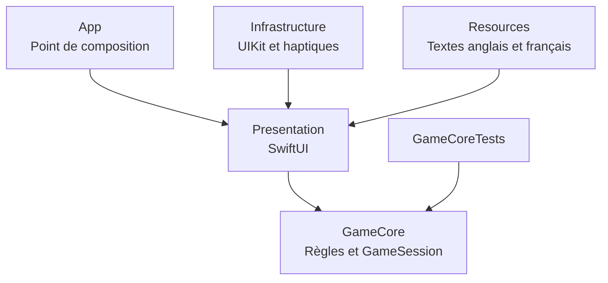
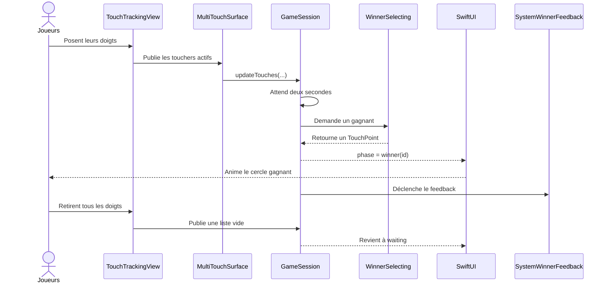
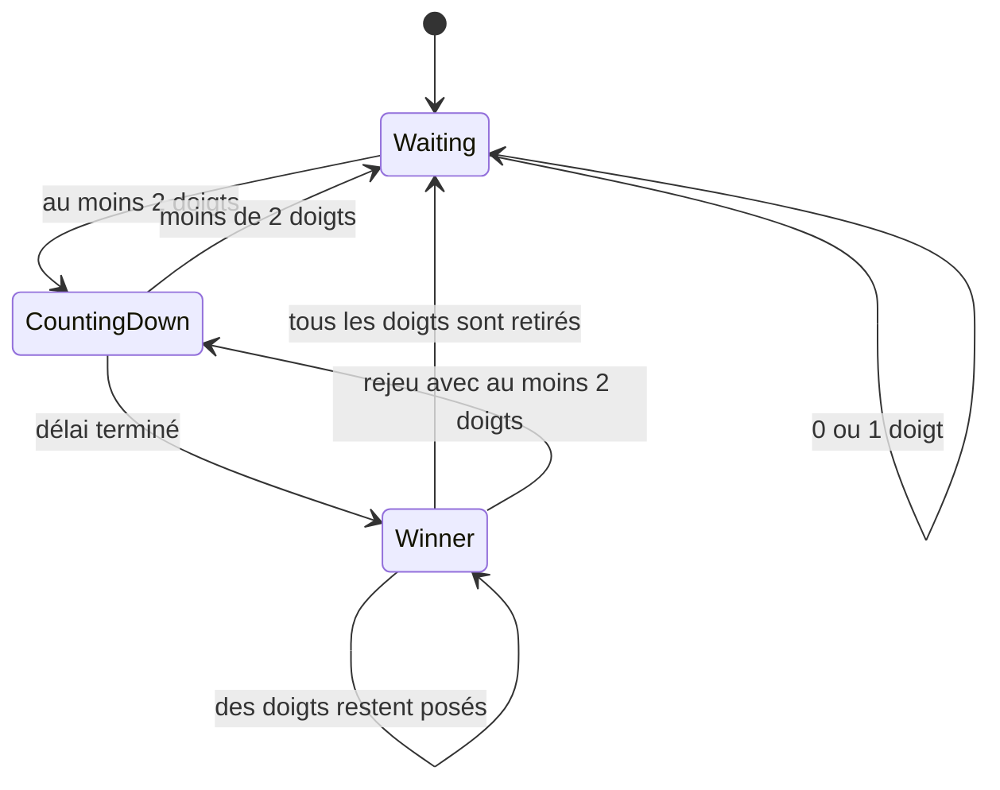

# Comprendre Swift et le projet TabTaker

Ce tutoriel explique les bases de Swift, le fonctionnement de SwiftUI et l'organisation du projet TabTaker. Il est conçu pour une personne qui n'a encore jamais développé en Swift.

> Le nom visible de l'application et son bundle ID sont **TabTaker** et `com.thomaslaure.tabtaker`. Les noms techniques du projet (`WhoPays.xcodeproj` et cible `WhoPays`) restent inchangés : ils ne sont pas visibles par les utilisateurs.

## Vue d'ensemble

L'idée centrale de l'application est simple : SwiftUI décrit l'écran, `GameSession` décide ce qui doit arriver, UIKit détecte les doigts, puis SwiftUI redessine automatiquement les parties affectées.

```text
Événement utilisateur → modification de l'état → mise à jour automatique de la vue
```

## Structure générale

```text
WhoPays/
├── README.md
├── docs/
│   └── tuto.md
├── WhoPays.xcodeproj/          Configuration Xcode
├── WhoPays/                    Code de l'application
│   ├── App/                    Point d'entrée
│   ├── Presentation/           État et vues SwiftUI
│   ├── Infrastructure/         APIs techniques Apple
│   └── Resources/              Traductions
├── GameCore/                   Package Swift local : règles du jeu
│   ├── Sources/GameCore/
│   └── Tests/GameCoreTests/    Tests unitaires rapides
└── WhoPaysTests/               Tests iOS, dont les traductions
```

Cette organisation applique une Clean Architecture légère et proportionnée à la taille du projet.



`GameCore` ne connaît ni SwiftUI ni UIKit. Cela permet de comprendre et tester les règles du jeu sans dépendre de l'affichage, du simulateur ou du matériel.

## Premières bases de Swift

### `let` et `var`

```swift
let id: UUID
var location: CGPoint
```

- `let` déclare une valeur qui ne peut plus être modifiée après son initialisation.
- `var` déclare une valeur modifiable.

Swift encourage l'utilisation de `let` par défaut. Une valeur ne devrait être mutable que lorsque le comportement du programme l'exige réellement.

### Les types

Swift est un langage fortement et statiquement typé. Le compilateur connaît le type de chaque valeur avant de produire l'application.

```swift
let playerCount: Int = 2
let title: String = "TabTaker"
let isReady: Bool = true
```

Swift sait souvent déduire le type :

```swift
let playerCount = 2
```

Ici, le compilateur comprend automatiquement que `playerCount` est un `Int`.

### `struct` et `class`

```swift
struct TouchPoint { }
final class GameSession { }
```

Une `struct` est un type valeur. Lorsque sa valeur est copiée, la copie devient indépendante.

Une `class` est un type référence. Plusieurs endroits du programme peuvent observer et manipuler le même objet.

WhoPays utilise :

- une `struct` pour représenter un doigt ;
- une `class` pour la session partagée et observable du jeu.

Le mot-clé `final` empêche la création d'une sous-classe. L'héritage n'étant pas utile pour `GameSession`, cette intention est rendue explicite.

### Les propriétés

Une propriété est une donnée appartenant à une structure ou une classe :

```swift
struct TouchPoint {
  let id: UUID
  var location: CGPoint
}
```

Une propriété peut également être calculée :

```swift
private var isCountingDown: Bool {
  if case .countingDown = session.phase { return true }
  return false
}
```

Cette propriété ne stocke rien. Sa valeur est recalculée lorsqu'elle est lue.

### Les fonctions

```swift
func selectWinner(from touches: [TouchPoint]) -> TouchPoint? {
  touches.randomElement()
}
```

- `func` déclare une fonction.
- `from` est le label utilisé lors de l'appel.
- `touches` est le nom interne du paramètre.
- `[TouchPoint]` est un tableau de doigts.
- `-> TouchPoint?` indique le type de retour.

L'appel correspondant est :

```swift
let winner = selector.selectWinner(from: touches)
```

### Les protocoles

```swift
protocol WinnerSelecting {
  func selectWinner(from touches: [TouchPoint]) -> TouchPoint?
}
```

Un protocole décrit un contrat. Toute implémentation conforme à `WinnerSelecting` doit fournir la fonction demandée.

C'est l'équivalent conceptuel d'une interface dans de nombreux autres langages.

Le protocole permet à l'application d'utiliser `RandomWinnerSelector`, tandis que les tests utilisent un sélecteur prévisible.

### Les optionnels

```swift
TouchPoint?
```

Le `?` signifie que la valeur peut être présente ou absente. Un tableau vide ne peut pas produire de gagnant, donc `randomElement()` retourne un optionnel.

On peut déballer proprement un optionnel avec `guard let` :

```swift
guard let winner = winnerSelector.selectWinner(from: touches) else {
  phase = .waiting
  return
}
```

Si aucun gagnant n'existe, le bloc `else` est exécuté et la fonction s'arrête. Après le `guard`, Swift sait que `winner` contient une vraie valeur.

### Les closures

```swift
let action: () -> Void
```

Une closure est une fonction transportée comme une valeur.

- `()` signifie qu'elle ne reçoit aucun paramètre.
- `Void` signifie qu'elle ne retourne aucune valeur utile.

`ReplayButton` reçoit ainsi l'action à exécuter sans avoir besoin de connaître `GameSession`.

### Les contrôles de flux

#### `if`

```swift
if trackedTouches.isEmpty {
  nextColorIndex = 0
}
```

#### `guard`

```swift
guard touches.count >= 2 else {
  phase = .waiting
  return
}
```

`guard` sert à exprimer les conditions nécessaires pour continuer. Il réduit l'imbrication et rend le chemin principal plus lisible.

#### `switch`

```swift
switch phase {
case .waiting:
  // Attendre
case .countingDown:
  // Compter
case .winner:
  // Afficher le gagnant
}
```

Avec une `enum`, Swift oblige le programme à traiter tous les cas possibles.

### Les niveaux d'accès

```swift
private(set) var phase: Phase = .waiting
```

Les autres fichiers peuvent lire `phase`, mais seul `GameSession` peut la modifier.

Autres niveaux courants :

- `private` : accessible uniquement dans la portée concernée ;
- `fileprivate` : accessible uniquement dans le même fichier ;
- `internal` : accessible dans le module, valeur par défaut ;
- `public` : accessible depuis d'autres modules.

## Comprendre SwiftUI

SwiftUI est un framework déclaratif. Une vue décrit l'apparence correspondant à l'état actuel au lieu de modifier manuellement chaque élément à l'écran.

```swift
struct ReplayButton: View {
  var body: some View {
    Button("Play again") {
      // Action
    }
  }
}
```

### `View` et `body`

Une vue SwiftUI se conforme au protocole `View` et fournit une propriété `body`.

```swift
var body: some View
```

`some View` signifie que le corps retourne un type précis conforme à `View`, sans exposer son type générique très complexe.

### Les modificateurs

```swift
Text("Who pays?")
  .font(.headline)
  .foregroundStyle(.white)
  .padding()
```

Les méthodes commençant par un point sont des modificateurs. Chaque modificateur produit une nouvelle vue configurée.

L'ordre peut avoir de l'importance. Par exemple, appliquer un fond avant ou après un `padding` ne produit pas forcément la même surface.

### Les piles

- `VStack` empile verticalement.
- `HStack` empile horizontalement.
- `ZStack` superpose les éléments.

WhoPays utilise un `ZStack` afin de superposer :

1. le fond noir ;
2. la surface tactile ;
3. les marqueurs des doigts ;
4. les textes ;
5. le bouton de rejeu.

### L'état avec `@State`

```swift
@State private var session: GameSession
```

`@State` indique que la vue possède cet état. Lorsque les données observées changent, SwiftUI recalcule les vues qui en dépendent.

### L'observation avec `@Observable`

```swift
@Observable
final class GameSession
```

La macro `@Observable` permet à SwiftUI de suivre les propriétés lues par les vues.

Quand le code exécute :

```swift
phase = .winner(winner.id)
```

les vues qui lisent `phase` sont automatiquement mises à jour.

### `@MainActor`

```swift
@MainActor
final class GameSession
```

Le `MainActor` représente le contexte principal utilisé par l'interface. Cette annotation empêche des modifications concurrentes dangereuses de l'état visuel.

### Construire une liste de vues avec `ForEach`

```swift
ForEach(session.touches) { touch in
  FingerMarker(...)
    .position(touch.location)
}
```

SwiftUI crée un marqueur pour chaque doigt. Comme `TouchPoint` respecte `Identifiable`, SwiftUI sait quel élément apparaît, bouge ou disparaît.

### `@ViewBuilder`

```swift
@ViewBuilder
private var markerContent: some View {
  if isWinner {
    Image(systemName: "creditcard.fill")
  } else {
    Text("Player")
  }
}
```

`@ViewBuilder` permet de composer des vues avec des conditions sans construire manuellement un type commun.

### Les previews

```swift
#Preview {
  GameView()
}
```

Une preview permet à Xcode d'afficher une vue sans lancer manuellement tout le parcours de l'application.

## Explication des fichiers

## `App/WhoPaysApp.swift`

C'est le point d'entrée :

```swift
@main
struct WhoPaysApp: App {
  var body: some Scene {
    WindowGroup {
      GameView()
        .preferredColorScheme(.dark)
    }
  }
}
```

- `@main` indique où l'application commence.
- `App` est le protocole représentant une application SwiftUI.
- `WindowGroup` crée la fenêtre principale.
- `GameView()` crée l'écran du jeu.
- `preferredColorScheme(.dark)` impose une interface sombre.

## `Domain/TouchPoint.swift`

Ce fichier représente un doigt actif :

```swift
struct TouchPoint: Identifiable, Equatable {
  let id: UUID
  var location: CGPoint
  let colorIndex: Int
}
```

- `id` identifie le doigt de manière stable.
- `location` contient ses coordonnées `x` et `y`.
- `colorIndex` détermine sa couleur.
- `Identifiable` permet son utilisation dans `ForEach`.
- `Equatable` permet de comparer deux valeurs et facilite les tests et animations.

## `Domain/WinnerSelecting.swift`

Le protocole définit la capacité à sélectionner un gagnant :

```swift
protocol WinnerSelecting {
  func selectWinner(from touches: [TouchPoint]) -> TouchPoint?
}
```

L'implémentation de production utilise :

```swift
touches.randomElement()
```

Séparer le contrat de son implémentation rend le comportement remplaçable dans les tests.

## `Presentation/GameSession.swift`

`GameSession` est le cerveau du jeu.

### Les phases

```swift
enum Phase: Equatable {
  case waiting
  case countingDown(deadline: Date)
  case winner(UUID)
}
```

Le jeu se trouve toujours dans une seule phase :

- attente ;
- compte à rebours ;
- gagnant choisi.

Le cas `winner(UUID)` transporte l'identifiant du doigt gagnant.

Cette enum évite plusieurs booléens contradictoires comme `isWaiting`, `isCountingDown` et `hasWinner`.

### Les dépendances

```swift
private let countdownDuration: Duration
private let winnerSelector: any WinnerSelecting
private let winnerFeedback: any WinnerFeedbackProviding
```

Ces objets sont injectés dans l'initialiseur. La production utilise les valeurs par défaut, tandis que les tests fournissent des versions contrôlées.

### Mise à jour des doigts

```swift
func updateTouches(_ touches: [TouchPoint])
```

Cette méthode reçoit la liste complète des doigts et décide de la transition d'état :

- moins de deux doigts : attendre ou annuler ;
- au moins deux doigts : démarrer le compte à rebours ;
- résultat déjà choisi : conserver le résultat ;
- aucun doigt après le résultat : réinitialiser.

### Travail asynchrone avec `Task`

```swift
selectionTask = Task { [weak self] in
  do {
    try await Task.sleep(for: delay)
    guard !Task.isCancelled else { return }
    self?.finishCountdown()
  } catch {
    // Une annulation est normale ici.
  }
}
```

`Task` lance un travail asynchrone. `await` suspend cette tâche sans bloquer l'interface.

Si le nombre de doigts devient insuffisant, la tâche est annulée :

```swift
selectionTask?.cancel()
```

`[weak self]` empêche la tâche de conserver inutilement la session en mémoire.

### Choix final

```swift
phase = .winner(winner.id)
winnerFeedback.playWinnerFeedback()
```

La modification de `phase` déclenche la mise à jour SwiftUI. Le feedback haptique est demandé séparément via son protocole.

### Extension de `Duration`

```swift
extension Duration {
  fileprivate var timeInterval: TimeInterval
}
```

Une extension ajoute une capacité à un type existant. Ici, elle convertit une `Duration` en nombre de secondes pour calculer la date de fin.

## `Presentation/GameText.swift`

Ce fichier centralise les clés de traduction :

```swift
static let playAgain: LocalizedStringResource = "action.play_again"
```

Le code manipule une clé stable. Le catalogue fournit ensuite la traduction correspondant à la langue de l'appareil.

## `Presentation/WinnerFeedbackProviding.swift`

```swift
protocol WinnerFeedbackProviding {
  @MainActor
  func playWinnerFeedback()
}
```

Ce protocole sépare la demande fonctionnelle — signaler un gagnant — de l'implémentation technique utilisant les moteurs haptiques Apple.

## `Presentation/GameView.swift`

Il s'agit de l'écran principal.

```swift
ZStack {
  Color.black
  MultiTouchSurface(...)
  FingerMarker(...)
  GameChrome(...)
  ReplayButton(...)
}
```

`GameView` :

- possède la `GameSession` ;
- reçoit les événements tactiles ;
- crée un marqueur pour chaque doigt ;
- transmet seulement les données nécessaires aux petits composants ;
- anime les changements de phase et de position.

La sélection d'une couleur utilise le modulo :

```swift
colors[touch.colorIndex % colors.count]
```

Si le nombre de doigts dépasse le nombre de couleurs, la palette recommence depuis le début sans dépasser les limites du tableau.

## `Presentation/Components/GameChrome.swift`

Ce composant affiche le titre et le message d'état.

Des propriétés calculées utilisent un `switch` pour associer chaque phase à :

- un texte ;
- une instruction ;
- une icône SF Symbols.

`GameHeader` et `StatusPill` sont privés au fichier parce qu'aucune autre partie du projet n'en a besoin.

## `Presentation/Components/FingerMarker.swift`

Ce composant dessine le cercle d'un doigt :

- cercle extérieur ;
- centre coloré ;
- numéro du joueur ;
- icône de carte lorsque ce doigt gagne ;
- agrandissement et ombre pour l'animation du gagnant.

Il ne connaît pas toute la session. Il reçoit uniquement les valeurs nécessaires à son rendu.

## `Presentation/Components/ReplayButton.swift`

Le bouton reçoit :

```swift
let isVisible: Bool
let action: () -> Void
```

Il reste dans l'arbre SwiftUI et devient transparent lorsqu'il ne doit pas apparaître :

```swift
.opacity(isVisible ? 1 : 0)
.allowsHitTesting(isVisible)
.accessibilityHidden(!isVisible)
```

Les interactions et VoiceOver sont désactivés lorsque le bouton est invisible. Garder une structure de vues stable rend l'identité et les animations plus prévisibles.

## `Infrastructure/MultiTouchSurface.swift`

SwiftUI ne fournit pas ici un suivi pratique de plusieurs `UITouch` indépendants. Le projet utilise donc une petite vue UIKit.

### Pont entre UIKit et SwiftUI

```swift
struct MultiTouchSurface: UIViewRepresentable
```

`UIViewRepresentable` permet d'intégrer une `UIView` UIKit dans une vue SwiftUI.

- `makeUIView` crée la vue UIKit.
- `updateUIView` met à jour sa configuration.
- `Coordinator` transmet les événements vers SwiftUI.

### Activation du multi-touch

```swift
view.isMultipleTouchEnabled = true
```

Sans cette option, la vue ne recevrait pas correctement tous les doigts d'une séquence multi-touch.

### Cycle d'un toucher UIKit

UIKit appelle automatiquement :

- `touchesBegan` lorsqu'un doigt arrive ;
- `touchesMoved` lorsqu'il bouge ;
- `touchesEnded` lorsqu'il est retiré ;
- `touchesCancelled` lorsque le système interrompt le geste.

Chaque `UITouch` devient une clé stable dans un dictionnaire :

```swift
private var trackedTouches: [ObjectIdentifier: TrackedTouch] = [:]
```

`publishTouches()` transforme ensuite les objets UIKit en valeurs `[TouchPoint]` appartenant à l'application.

UIKit reste ainsi limité à la couche Infrastructure.

## `Infrastructure/SystemWinnerFeedback.swift`

Ce fichier produit deux retours haptiques :

```swift
notification.notificationOccurred(.success)
```

puis un impact rigide 180 millisecondes plus tard.

Le simulateur ne reproduit pas réellement ces vibrations. Elles doivent être vérifiées sur un iPhone physique.

## `Resources/Localizable.xcstrings`

Le String Catalog contient les textes anglais et français.

```text
title.place_fingers
├── en: Place your fingers
└── fr: Posez vos doigts
```

iOS sélectionne automatiquement la traduction selon la langue choisie pour l'appareil ou pour l'application.

## Comprendre les tests

Les tests utilisent XCTest, le framework de tests Apple.

## `GameCore/Tests/GameCoreTests/GameSessionTests.swift`

Ce fichier vérifie :

- l'état initial ;
- le comportement avec un doigt ;
- le démarrage avec deux doigts ;
- l'annulation du compte à rebours ;
- la sélection du gagnant ;
- le feedback ;
- le déplacement des doigts ;
- le reset automatique ;
- le reset manuel ;
- l'absence exceptionnelle de gagnant.

### Test double du sélecteur

```swift
private struct FixedWinnerSelector: WinnerSelecting
```

Il retourne un gagnant connu au lieu d'utiliser le hasard. Un test doit produire le même résultat à chaque exécution.

### Espion du feedback

```swift
private final class FeedbackSpy: WinnerFeedbackProviding
```

Il ne fait pas vibrer l'appareil. Il compte combien de fois le feedback a été demandé.

## `GameCore/Tests/GameCoreTests/RandomWinnerSelectorTests.swift`

Ce fichier vérifie les limites importantes :

- une liste vide ne produit aucun gagnant ;
- un doigt seul est nécessairement sélectionné.

Un test statistique du hasard serait instable et apporterait peu de valeur.

## `WhoPaysTests/LocalizationTests.swift`

Ces tests chargent les bundles `en.lproj` et `fr.lproj`, puis vérifient chaque traduction attendue.

Ils détectent notamment :

- une clé absente ;
- une traduction supprimée ;
- une langue non incluse dans l'application compilée.

## Injection de dépendances

La production utilise les dépendances par défaut :

```swift
GameSession(winnerFeedback: SystemWinnerFeedback())
```

Les tests les remplacent :

```swift
GameSession(
  countdownDuration: .zero,
  winnerSelector: FixedWinnerSelector(selectedID: expectedID),
  winnerFeedback: FeedbackSpy()
)
```

Les tests deviennent rapides et fiables : ils n'attendent pas deux secondes, ne dépendent pas du hasard et ne tentent pas de faire vibrer le simulateur.

## Couverture de tests

La logique de sélection et la machine d'état `GameSession` possèdent 100 % de couverture de lignes.

Les interactions UIKit, le rendu SwiftUI et les vibrations physiques sont des frontières d'intégration. Elles sont vérifiées avec des builds, des captures, le simulateur et un appareil physique plutôt qu'avec des tests unitaires artificiels.

Dans Xcode :

1. utiliser `⌘U` ou **Product > Test** ;
2. ouvrir le Report navigator ;
3. sélectionner le dernier rapport de tests ;
4. afficher l'onglet Coverage.

## Fichiers de configuration Xcode

## `WhoPays.xcodeproj/project.pbxproj`

Ce fichier contient :

- les cibles application et tests ;
- l'identifiant de bundle ;
- la version minimale d'iOS ;
- les réglages Debug et Release ;
- les sources et ressources du projet.

Il est généralement modifié par Xcode. Un débutant ne devrait pas l'éditer manuellement.

## `WhoPays.xcodeproj/xcshareddata/xcschemes/WhoPays.xcscheme`

Le scheme décrit ce que Xcode doit compiler, lancer, tester, profiler ou archiver. La couverture des tests y est activée.

## `project.xcworkspace/contents.xcworkspacedata`

Ce fichier contient les métadonnées du workspace interne au projet Xcode.

## `xcuserdata/.../UserInterfaceState.xcuserstate`

Ce fichier stocke un état personnel de l'interface Xcode, comme les panneaux et fichiers ouverts.

Il ne fait pas partie du code de l'application et devrait normalement être ignoré par Git.

## Flux complet d'une partie



## Machine d'état



## Principes appliqués

- Lisibilité avant optimisation prématurée.
- Une seule source de vérité pour l'état du jeu.
- Types valeur pour les données du domaine.
- Protocoles aux frontières externes ou non déterministes.
- Injection de dépendances pour des tests déterministes.
- `@MainActor` pour l'état mutable appartenant à l'interface.
- Petites vues SwiftUI avec des entrées explicites.
- Arbre SwiftUI stable pour une identité et des animations prévisibles.
- Traductions natives avec un String Catalog.
- Aucune dépendance externe sans besoin démontré.

## Ordre conseillé pour apprendre le projet

1. `App/WhoPaysApp.swift`
2. `Presentation/GameView.swift`
3. `Domain/TouchPoint.swift`
4. `Presentation/GameSession.swift`
5. `Domain/WinnerSelecting.swift`
6. `Infrastructure/MultiTouchSurface.swift`
7. Les composants SwiftUI
8. `Infrastructure/SystemWinnerFeedback.swift`
9. Les tests
10. Le fichier `project.pbxproj` beaucoup plus tard

Le concept le plus important à retenir est :

```text
L'utilisateur agit
        ↓
L'état Swift change
        ↓
SwiftUI recalcule automatiquement l'affichage
```
